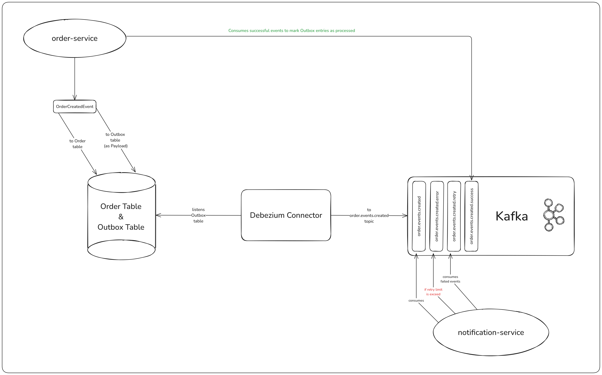
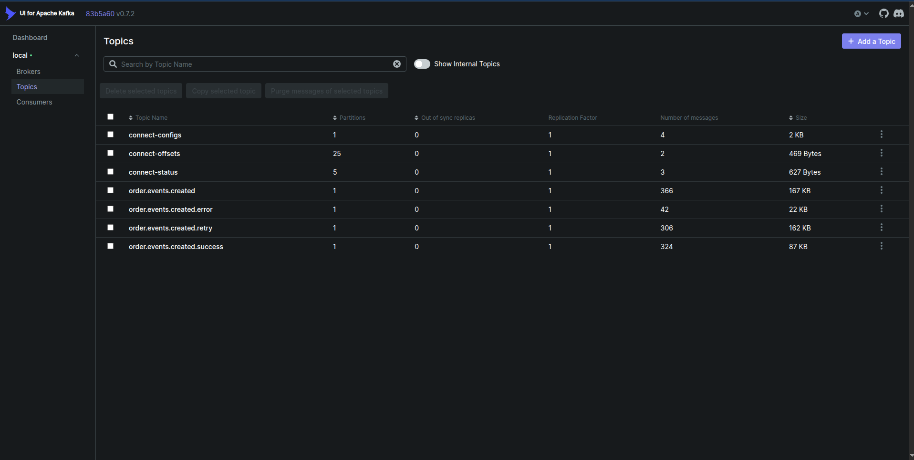

# Outbox Pattern Implementation

This project is an example implementation of the `Outbox Pattern` using Kafka and Debezium.
It serves as a proof of concept to demonstrate how to reliably publish domain events from a relational database
to Kafka in a microservices-friendly way.

###  

<p align="center">
    
</p>

### What is Outbox Pattern?

The Outbox Pattern is a design approach used to ensure reliable and consistent communication between services,
especially in event-driven architectures.

Instead of publishing events directly to a message broker like Kafka, events are first written to an outbox table
within the same database transaction as the business operation (e.g., creating an order). A separate process or tool,
such as Debezium, then reads from this table and publishes the events to a message broker.

This guarantees that either both the database change and the event are committed, or neither is.
This approach helps prevent data loss, maintain consistency, and ensure exactly-once message delivery.

### How to Run

Clone the project and navigate to the root directory:

```shell
git clone https://github.com/yusufemrebilgin/outbox-pattern-implementation.git && cd outbox-pattern-implementation
```

Build and run the services:

```shell
docker compose up --build -d
```

**Note:** After all services are up and running, you need to configure Debezium to start capturing and
publishing changes from the outbox table.

You can do this in one of the following ways:

- Use the provided Postman
  [collection](https://raw.githubusercontent.com/yusufemrebilgin/outbox-pattern-implementation/main/postman-collection/outbox-pattern-example.postman_collection.json)
  to send the required Debezium connector configuration request.
- Or run the helper script:

    ```shell
    ./connect-debezium.sh
    ```

To stop application:

```shell
docker compose down
```

### Testing with Mock Data

A helper script is included to send sample requests from the mock data file located at `data/mock-order-requests.txt`.

Run the script with default options:

```shell
./send-mock-orders.sh
```

Or use flags to customize behavior:

```shell
./send-mock-orders.sh [-d delay] [-i iterations] [-s]
```

**Available Options:**

| **Option**      | **Description**                                    |
|-----------------|----------------------------------------------------|
| `-d DELAY`      | Set delay between requests in seconds (default: 0) |
| `-i ITERATIONS` | Number of requests to send (default: 1000)         |
| `-s`            | Silent mode (suppress output)                      |

**Example**: Send 100 requests with 1-second delay

```shell
./send-mock-orders.sh -d 1 -i 100
```

### Observing Kafka Messages

To monitor the Kafka messages, you can use the Kafka UI, which has been included in the Docker Compose setup.
Once the services are running, navigate to http://localhost:8080 to access Kafka UI.

<p align="center">
    
</p>